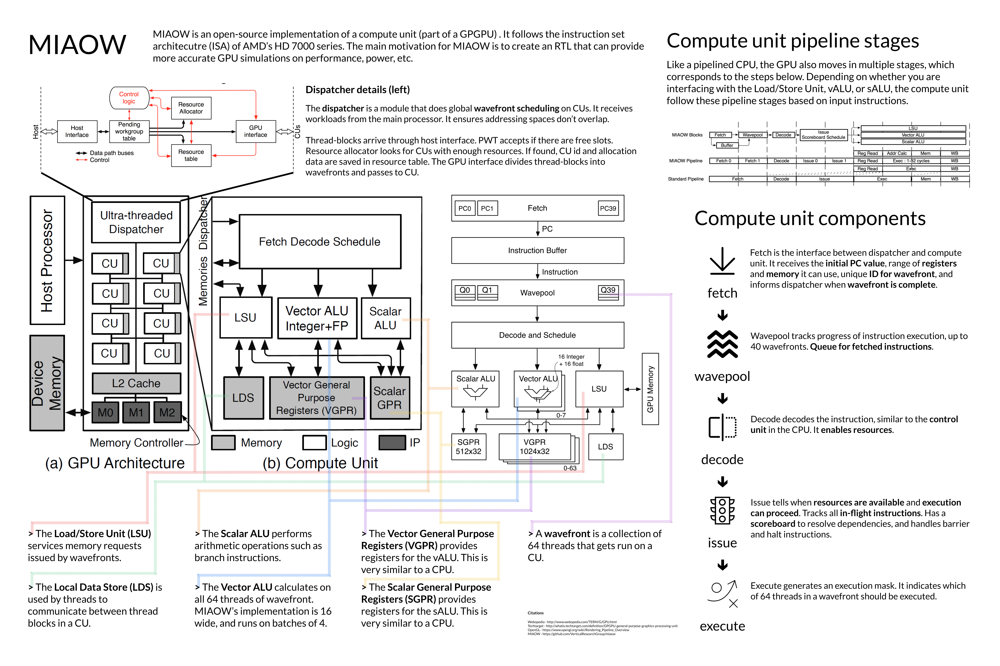

# Exploring the (GP)GPU
*David Zhu, Bill Du | Computer Architecture Fall 2016*

For Computer Architecture Fall 2016, we explored the CPU, starting with the fundamentals and moving to a specific implementation (MIAOW) and several example programs. The following sections document our learnings in this project.

## PART 1: Fundamentals

### About

To better understand the power of GPUs, we must first understand the fundamentals of this processor. The following poster is our synthesis of our research, detailing what a GPU and GPGPU is and how it compares with CPUs.

### Process
This knowledge is gained from a variety of sources. Here are a few.

- [TechTarget](http://searchvirtualdesktop.techtarget.com/definition/GPU-graphics-processing-unit) offers some basic definitions and historical contexts.
- [CUNY paper](http://compsci.hunter.cuny.edu/~sweiss/course_materials/csci360/lecture_notes/gpus.pdf) describes in greater detail the 3D functions of GPUs.
- [University of Bristol](http://lorenabarba.com/gpuatbu/Program_files/Cruz_gpuComputing09.pdf) is a quick presentation on GPU computing.
- [Common shader core](https://msdn.microsoft.com/en-us/library/bb509580(VS.85).aspx) is an example of a unified shader model.
- A [Microsoft Developer blog](https://blogs.msdn.microsoft.com/nativeconcurrency/2012/03/26/warp-or-wavefront-of-gpu-threads/) explains how branching may work inside a compute unit.
- [OpenGL](https://www.opengl.org/wiki/Rendering_Pipeline_Overview) has a detailed rendering pipeline which explains the execution process of a GPU.

Notes can be found in the `appendix/` folder, within the PDFs.

## PART 2: MIAOW

### About
Looking more specifically at GPUs, we discovered an open source implementation of a GPU’s compute unit, called MIAOW. From there, we took a deeper look at their whitepapers and source code to better understand how the internals of a GPU actually works. The following is a poster synthesis of our results:

### Process
MIAOW has a lot of great documentation. Here are the following:

- Their [Github](https://github.com/VerticalResearchGroup/miaow) contains the source code of their GPU, written using Verilog HDL.
- Their [whitepaper](https://raw.githubusercontent.com/wiki/VerticalResearchGroup/miaow/files/MIAOW_Architecture_Whitepaper.pdf) contains very important details on their architecture and process, which provided us the explanations and visuals you see in the above poster.
- [GCN Architecture Whitepaper](GCN Architecture Whitepaper) provides additional information on MIAOW’s AMD inspiration.

Additional notetaking can be found in the `appendix/` folder.

## PART 3: Programming

###About
For programming part, we experimented with three different  programs. One program is written in CUDA, while the other two are in OpenCL. They are built to experiment with image processing and matrix multiplication.
We wrote these programs to better understand parallel programming in practice, learning more about how working with CUDA and OpenCL is like. Parallel programming is a brand new field of programming that neither of us has learnt before. There are several new hardware paradigms that we must consider (as shown above) that also impact how we program, such as kernels and synchronization.

The typical workflow for running code on a GPU is as follows:

- Memory is allocated to the GPU based on what computation is needed.
- A programmed kernel is added to the GPU queue, waiting for execution.
- Data is sent to the GPU, which the kernel executes on.
- The result is collected from the GPU back to the host.
- Memory is freed.

Throughout this process, the programmer communicates with the GPU through a series of APIs that are defined by the GPU language. Inside a kernel,  

### CUDA Gaussian Blur
*Go to README.md under blur_image_CUDA to see details about the program.*

The first is a CUDA implementation of a Gaussian blur.  The program takes in and blurs an image given a matrix of weights (called a convolution kernel). The program breaks the image into a matrix of pixels and average each pixel’s RGB value based on Gaussian  weights, which is much smoother than simply averaging the adjacent pixels’ RGB values.

The CUDA implementation follows the [Udacity tutorials](https://www.udacity.com/course/intro-to-parallel-programming--cs344).

To reach our MVP, we went through an introductory course to parallel programming on Udacity. From there, we learned how parallel programming differs from serial programming and what unique patterns and performances it has, and in addition, how to write actual code.

Based on the instructions from that course, we wrote our own program to blur images. There were 3 steps to blur an image: breaking the image into 3 separate images that each one only contains one color channel, blur the 3 images by recalculating the color value for each pixel, and finally, recombining the 3 images to form the new blurred image. These 3 steps were written in 3 separate kernels in traditional C++. After that, we went on to the next step of parallel programming: allocating memories. We allocated shared memories for each block of threads and local memories for each individual thread, and copied the original picture data from host memory(CPU memory) to the device memory(GPU global memory).  Finally, we define the block size to be 64 by 64 and launch the kernels one by one. At the end of each kernel, we added a barrier to synchronize all threads, so that the GPU wait for all threads to finish the current kernel before going on to the next one.

#### Problems/Difficulties
When we started to learn parallel programming, the first thing we worried about is that neither of us know C/C++, which is used in both CUDA and OpenCL. For such reason, we struggled with writing the kernels, which are the foundations in GPU parallel programming. To solve this problem, we went through a lot of simple CUDA codes to get a sense of how C++ works, and as we became familiar with it, we became more confident . Another roadblock we encountered when coding was about memory allocation. Although we were clear about how global memory, shared memory, and local memory differs from each other, we were confused trying to allocate the correct type of memory. We spent a lot of time looking at sample codes and debugging and finally managed to fix the program.  After having  the CUDA code running correctly on the platform on Udacity, we tried to run it on our machines locally. However  we did not make it due to compatibility issues between CUDA toolkits and Microsoft Visual Studio.

### OpenCL Image Filters
The second program is an OpenCL implementation of simple filtering in general. It has a gaussian filter capability,  as well as examples of sharpening and primitive edge detection. One thing to note is that this implementation has less complexity than the one above because it does not split colors.
The image filter code is written by following/copying  this [OpenCL tutorial](https://anteru.net/blog/2012/11/03/2009/).

### OpenCL Matrix Multiplication
The third program is an OpenCL implementation of matrix multiplication. It can do large-scale matrix multiplication  in parallel, limited by workgroup sizes.

The matrix multiplication code is written by following/copying [this tutorial](http://gpgpu-computing4.blogspot.com/2009/09/matrix-multiplication-2-opencl.html).

**Both OpenCL codes live in the `opencl_experiments` directory. The README there will walk you through the execution.**

## Reflection
Generally, we reached our MVP and kept our project in a reasonable scale. We were cautious about scaling the project because we were new to GPU and parallel programming. We started from understanding basic concepts of the GPU, learned about its history, its function, and the difference between GPU and CPU. Then, we looked deeper into a GPU through an open source project called MIAOW. There we learned about its detailed structure and the cooperations among different components. We kept each other on the same page and did well on keeping the pace with our schedule. However the programming part was a bit trickier than we expected. Parallel programming was so much different from traditional programmings that we had written before. Thus, it took a long time for us to look for a programming platform and go through the tutorials. Our stretch goal for the programming part was to create a CUDA program that enables seamless picture blending, but as the project went further, we realized that we do not have time to reach that far. The course on Udacity was a 3-month full course and we were impossible to go through all of it. So we finally settled down on producing simple image processing and matrix multiplication, and that worked well. In all, we met our learning goals and were satisfied with how far we have reached in this project.
